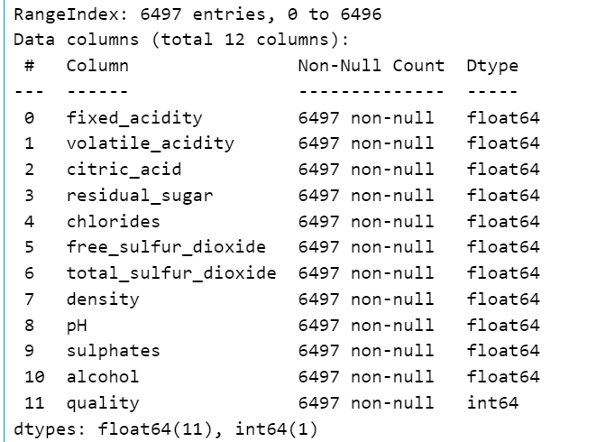
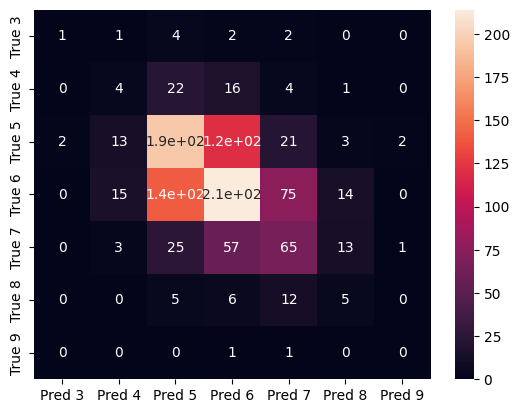

# ID2223_LAB1

## Authors
Jingyuan Han & Kaidi Xu

## Some Dependencies
python==3.8.5

sklearn==1.1.1

hopsworks

modal

huggingface

## Task2

### 1. Wine quality dataset
The information of the dataset is:

There are 12 columns in the dataset, where 11 are features of the wine and one is the target ("quality").

### 2. Modeling
Since it is a classification problem, we used a decision tree as the model. The training criterion is "gini".

### 3. Evaluation
We used both classification_report() and confusion matrix to evaluate the model. The performance of the model, however, was not so good. The classification accuracy was 0.438. The confusiton matrix of the test data was:

### 4. How to run
1. wine-eda-and-backfill
This notebook was aimed to get the dataset, process the data, and upload the data to the feature group of hopworks (backfilling)

2. wine-training-pipeline
This notebook was aimed to build a ML model using the data from a feature view, and evaluate the performance of the data. In the end, the model was uploaded to the model registry of hopsworks.

3. daily-wine-feature-pipeline
This py file would generate a wine sample everyday and insert it to the feature group on hopsworks

4. wine_batch_inference_pipline
This py file would make predictions of the data in the current feature group evey day. Moreover, it created a monitor feature group, which will record the latest 2 preditions. 

A confusion matrix will be made based on the daliy predictions and be uploaded to the dataset api on hopsworks.

### Huggingface URL
https://huggingface.co/spaces/Han760/ID2223_wine

https://huggingface.co/spaces/Han760/ID2223_wine_monitor
